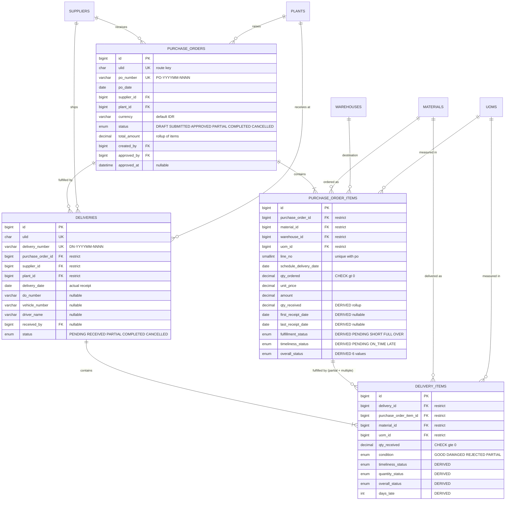
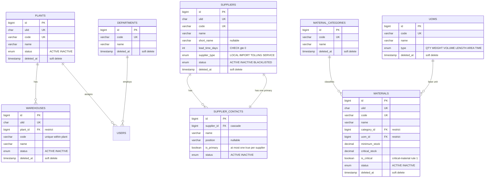
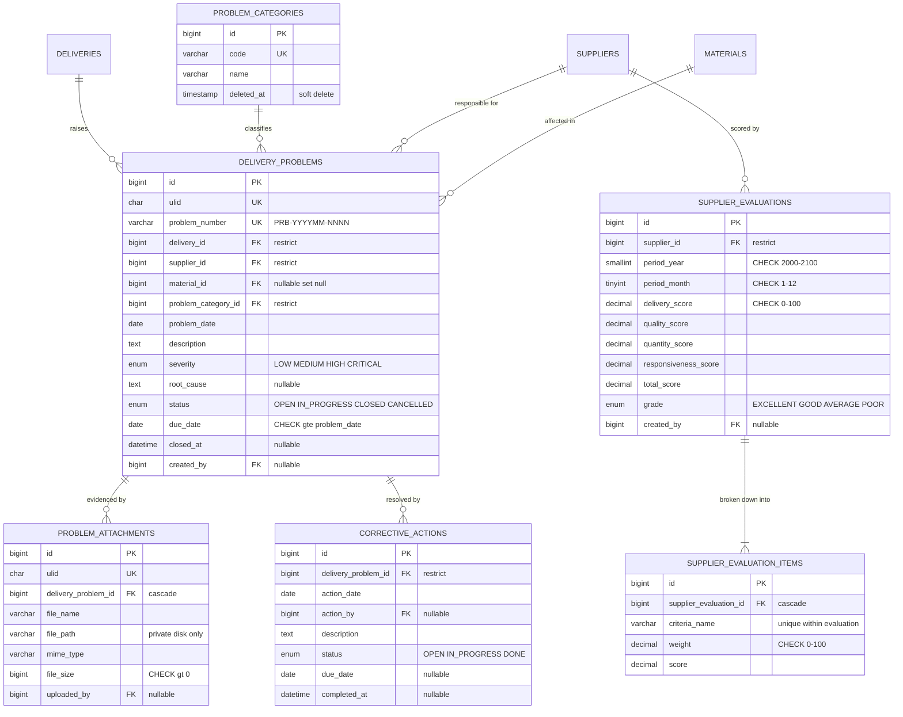
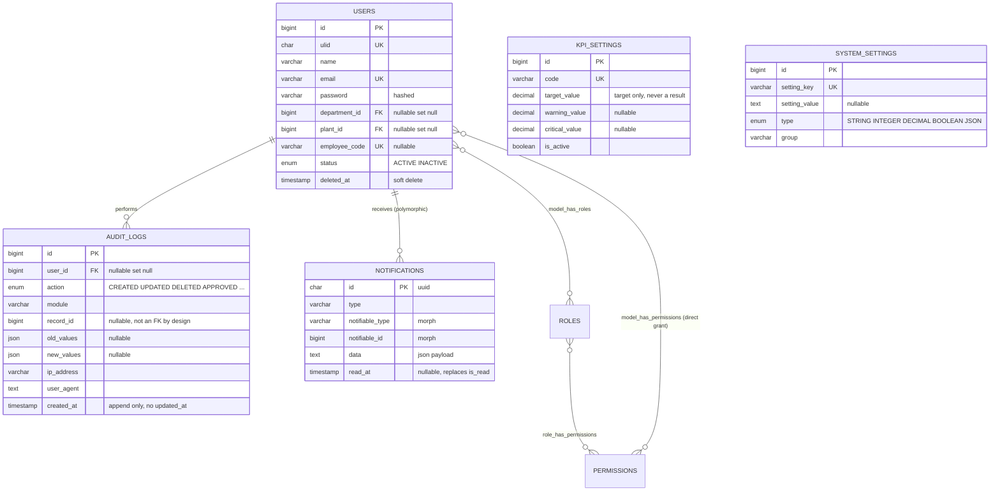
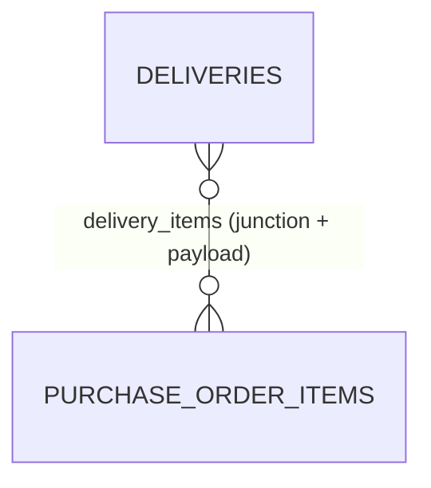

# ERD — Production-Ready Database Design

**Material Delivery Performance Monitoring System**

This document specifies the physical database, not a picture of it. Every table,
column, type, key, constraint, index and cascade rule below is implemented in
`database/migrations/` and verified by `tests/Feature/Database/`.

Target engine: **MySQL 8 / InnoDB / utf8mb4_unicode_ci**. The test suite runs on
SQLite; the two differences that matter are called out where they occur.

## 0. Design principles

1. **Purchase Order and Delivery are separate tables.** A PO is a commitment; a
   delivery is an event. Merging them would make partial and multiple delivery
   unrepresentable.
2. **`purchase_order_items` 1:N `delivery_items`.** One ordered line may be
   fulfilled by many receipts across many deliveries — this is what makes
   partial delivery work.
3. **No KPI is stored as a number.** `kpi_settings` stores *targets*, never
   *results*. Every dashboard figure is an aggregate over transactions.
4. **Derived status columns are denormalised on purpose,** so the dashboard
   aggregates in SQL instead of in PHP. They have exactly one writer,
   `DeliveryStatusService`, and a test proves the stored values match a fresh
   recalculation.
5. **History is never destroyed.** Master data soft-deletes; transactions are
   cancelled, never deleted.

---

# A. ERD (Mermaid)

## A.1 Transactional core — the part that must be right



## A.2 Master data



## A.3 Problem management and supplier evaluation



## A.4 Security, configuration and audit



---

# B. Database Dictionary

**Legend** — `PK` primary key · `UK` unique · `FK` foreign key · `IDX` indexed ·
`NN` NOT NULL · `NULL` nullable · `DRV` derived column, written only by
`DeliveryStatusService`.

All tables: `ENGINE=InnoDB`, `CHARSET=utf8mb4`, `COLLATE=utf8mb4_unicode_ci`.
All `id` columns: `BIGINT UNSIGNED NOT NULL AUTO_INCREMENT PRIMARY KEY`.
All `created_at` / `updated_at`: `TIMESTAMP NULL DEFAULT NULL` (Laravel writes them).

## B.1 `departments`

| Column | Type | Null | Default | Key | Notes |
|---|---|---|---|---|---|
| id | BIGINT UNSIGNED | NN | AUTO | PK | |
| code | VARCHAR(20) | NN | — | UK | e.g. `PUR`, `WHS` |
| name | VARCHAR(100) | NN | — | | |
| description | TEXT | NULL | NULL | | |
| status | ENUM('ACTIVE','INACTIVE') | NN | `ACTIVE` | IDX | |
| created_at | TIMESTAMP | NULL | NULL | | |
| updated_at | TIMESTAMP | NULL | NULL | | |
| deleted_at | TIMESTAMP | NULL | NULL | | soft delete |

## B.2 `plants`

| Column | Type | Null | Default | Key | Notes |
|---|---|---|---|---|---|
| id | BIGINT UNSIGNED | NN | AUTO | PK | |
| ulid | CHAR(26) | NN | — | UK | public route key |
| code | VARCHAR(10) | NN | — | UK | `PLANT-01` |
| name | VARCHAR(100) | NN | — | IDX | |
| address | TEXT | NULL | NULL | | |
| city | VARCHAR(100) | NULL | NULL | | |
| pic_name | VARCHAR(100) | NULL | NULL | | |
| pic_phone | VARCHAR(30) | NULL | NULL | | |
| status | ENUM('ACTIVE','INACTIVE') | NN | `ACTIVE` | IDX | |
| created_at / updated_at | TIMESTAMP | NULL | NULL | | |
| deleted_at | TIMESTAMP | NULL | NULL | | soft delete |

## B.3 `warehouses`

| Column | Type | Null | Default | Key | Notes |
|---|---|---|---|---|---|
| id | BIGINT UNSIGNED | NN | AUTO | PK | |
| ulid | CHAR(26) | NN | — | UK | |
| plant_id | BIGINT UNSIGNED | NN | — | FK → `plants.id` **RESTRICT** | |
| code | VARCHAR(20) | NN | — | UK *(plant_id, code)* | unique **within** a plant |
| name | VARCHAR(100) | NN | — | | |
| address | TEXT | NULL | NULL | | |
| status | ENUM('ACTIVE','INACTIVE') | NN | `ACTIVE` | IDX | |
| created_at / updated_at | TIMESTAMP | NULL | NULL | | |
| deleted_at | TIMESTAMP | NULL | NULL | | soft delete |

## B.4 `suppliers`

| Column | Type | Null | Default | Key | Notes |
|---|---|---|---|---|---|
| id | BIGINT UNSIGNED | NN | AUTO | PK | |
| ulid | CHAR(26) | NN | — | UK | |
| code | VARCHAR(20) | NN | — | UK | `SUP-001` |
| name | VARCHAR(150) | NN | — | IDX | |
| short_name | VARCHAR(100) | NULL | NULL | | |
| address | TEXT | NULL | NULL | | |
| city | VARCHAR(100) | NULL | NULL | | |
| country | VARCHAR(100) | NN | `Indonesia` | | |
| pic_name | VARCHAR(100) | NULL | NULL | | |
| pic_email | VARCHAR(100) | NULL | NULL | | |
| pic_phone | VARCHAR(30) | NULL | NULL | | |
| lead_time_days | INT UNSIGNED | NN | `0` | | CHECK `>= 0` |
| payment_term | VARCHAR(50) | NULL | NULL | | |
| supplier_type | ENUM('LOCAL','IMPORT','TOLLING','SERVICE') | NN | `LOCAL` | IDX | |
| status | ENUM('ACTIVE','INACTIVE','BLACKLISTED') | NN | `ACTIVE` | IDX | |
| created_at / updated_at | TIMESTAMP | NULL | NULL | | |
| deleted_at | TIMESTAMP | NULL | NULL | | soft delete |

## B.5 `supplier_contacts`

| Column | Type | Null | Default | Key | Notes |
|---|---|---|---|---|---|
| id | BIGINT UNSIGNED | NN | AUTO | PK | |
| supplier_id | BIGINT UNSIGNED | NN | — | FK → `suppliers.id` **CASCADE** | contacts die with the supplier |
| name | VARCHAR(100) | NN | — | | |
| position | VARCHAR(100) | NULL | NULL | | |
| phone | VARCHAR(30) | NULL | NULL | | |
| email | VARCHAR(100) | NULL | NULL | | |
| is_primary | TINYINT(1) | NN | `0` | IDX *(supplier_id, is_primary)* | at most one per supplier |
| status | ENUM('ACTIVE','INACTIVE') | NN | `ACTIVE` | | |
| created_at / updated_at | TIMESTAMP | NULL | NULL | | |

**No soft delete:** a contact is a detail of its supplier, not an entity with
independent history.

## B.6 `material_categories`

| Column | Type | Null | Default | Key |
|---|---|---|---|---|
| id | BIGINT UNSIGNED | NN | AUTO | PK |
| code | VARCHAR(20) | NN | — | UK |
| name | VARCHAR(100) | NN | — | |
| description | TEXT | NULL | NULL | |
| status | ENUM('ACTIVE','INACTIVE') | NN | `ACTIVE` | IDX |
| created_at / updated_at | TIMESTAMP | NULL | NULL | |
| deleted_at | TIMESTAMP | NULL | NULL | soft delete |

## B.7 `uoms`

| Column | Type | Null | Default | Key |
|---|---|---|---|---|
| id | BIGINT UNSIGNED | NN | AUTO | PK |
| code | VARCHAR(10) | NN | — | UK |
| name | VARCHAR(50) | NN | — | |
| type | ENUM('QTY','WEIGHT','VOLUME','LENGTH','AREA','TIME') | NN | `QTY` | |
| status | ENUM('ACTIVE','INACTIVE') | NN | `ACTIVE` | IDX |
| created_at / updated_at | TIMESTAMP | NULL | NULL | |
| deleted_at | TIMESTAMP | NULL | NULL | soft delete |

## B.8 `materials`

| Column | Type | Null | Default | Key | Notes |
|---|---|---|---|---|---|
| id | BIGINT UNSIGNED | NN | AUTO | PK | |
| ulid | CHAR(26) | NN | — | UK | |
| code | VARCHAR(30) | NN | — | UK | `MAT-0001` |
| name | VARCHAR(150) | NN | — | IDX | |
| category_id | BIGINT UNSIGNED | NN | — | FK → `material_categories.id` **RESTRICT** | |
| uom_id | BIGINT UNSIGNED | NN | — | FK → `uoms.id` **RESTRICT** | base unit |
| specification | TEXT | NULL | NULL | | |
| minimum_stock | DECIMAL(18,4) | NN | `0` | | CHECK `>= 0` |
| critical_stock | DECIMAL(18,4) | NN | `0` | | CHECK `>= 0` |
| lead_time_days | INT UNSIGNED | NN | `0` | | CHECK `>= 0` |
| is_critical | TINYINT(1) | NN | `0` | IDX | critical-material rule 1 |
| status | ENUM('ACTIVE','INACTIVE') | NN | `ACTIVE` | IDX | |
| created_at / updated_at | TIMESTAMP | NULL | NULL | | |
| deleted_at | TIMESTAMP | NULL | NULL | | soft delete |

## B.9 `purchase_orders`

| Column | Type | Null | Default | Key | Notes |
|---|---|---|---|---|---|
| id | BIGINT UNSIGNED | NN | AUTO | PK | |
| ulid | CHAR(26) | NN | — | UK | |
| po_number | VARCHAR(30) | NN | — | UK | `PO-YYYYMM-NNNN` |
| po_date | DATE | NN | — | IDX | |
| supplier_id | BIGINT UNSIGNED | NN | — | FK → `suppliers.id` **RESTRICT** | |
| plant_id | BIGINT UNSIGNED | NN | — | FK → `plants.id` **RESTRICT** | |
| currency | VARCHAR(10) | NN | `IDR` | | ISO code, no FX in scope |
| payment_term | VARCHAR(50) | NULL | NULL | | |
| status | ENUM('DRAFT','SUBMITTED','APPROVED','PARTIAL','COMPLETED','CANCELLED') | NN | `DRAFT` | IDX | |
| total_amount | DECIMAL(18,4) | NN | `0` | | rollup of items, CHECK `>= 0` |
| remarks | TEXT | NULL | NULL | | |
| created_by | BIGINT UNSIGNED | NULL | NULL | FK → `users.id` **SET NULL** | |
| approved_by | BIGINT UNSIGNED | NULL | NULL | FK → `users.id` **SET NULL** | |
| approved_at | DATETIME | NULL | NULL | | |
| created_at / updated_at | TIMESTAMP | NULL | NULL | | |

**No `deleted_at`.** A purchase order is business history — cancellation is
`status = CANCELLED`.

Composite indexes: `(plant_id, po_date)`, `(supplier_id, po_date)`, `(status, po_date)`.

## B.10 `purchase_order_items`

| Column | Type | Null | Default | Key | Notes |
|---|---|---|---|---|---|
| id | BIGINT UNSIGNED | NN | AUTO | PK | |
| purchase_order_id | BIGINT UNSIGNED | NN | — | FK → `purchase_orders.id` **RESTRICT** | an order line is business history |
| material_id | BIGINT UNSIGNED | NN | — | FK → `materials.id` **RESTRICT** | |
| warehouse_id | BIGINT UNSIGNED | NN | — | FK → `warehouses.id` **RESTRICT** | delivery destination |
| uom_id | BIGINT UNSIGNED | NN | — | FK → `uoms.id` **RESTRICT** | ordering unit |
| line_no | SMALLINT UNSIGNED | NN | — | UK *(purchase_order_id, line_no)* | CHECK `> 0` |
| schedule_delivery_date | DATE | NN | — | IDX | the promise being measured |
| qty_ordered | DECIMAL(18,4) | NN | — | | CHECK `> 0` |
| unit_price | DECIMAL(18,4) | NN | `0` | | CHECK `>= 0` |
| amount | DECIMAL(18,4) | NN | `0` | | `qty_ordered × unit_price` |
| **qty_received** | DECIMAL(18,4) | NN | `0` | | **DRV** Σ of countable delivery lines |
| **first_receipt_date** | DATE | NULL | NULL | | **DRV** |
| **last_receipt_date** | DATE | NULL | NULL | | **DRV** decides timeliness |
| **fulfillment_status** | ENUM('PENDING','SHORT','FULL','OVER') | NN | `PENDING` | IDX | **DRV** |
| **timeliness_status** | ENUM('PENDING','ON_TIME','LATE') | NN | `PENDING` | IDX | **DRV** |
| **overall_status** | ENUM('PENDING','ON_TIME_FULL','LATE_FULL','ON_TIME_SHORT','LATE_SHORT','OVER_DELIVERY') | NN | `PENDING` | IDX | **DRV** |
| remarks | TEXT | NULL | NULL | | |
| created_at / updated_at | TIMESTAMP | NULL | NULL | | |

Composite indexes: `(schedule_delivery_date, overall_status)`,
`(fulfillment_status, schedule_delivery_date)`, `(material_id, schedule_delivery_date)`.

## B.11 `deliveries`

| Column | Type | Null | Default | Key | Notes |
|---|---|---|---|---|---|
| id | BIGINT UNSIGNED | NN | AUTO | PK | |
| ulid | CHAR(26) | NN | — | UK | |
| delivery_number | VARCHAR(30) | NN | — | UK | `DN-YYYYMM-NNNN` |
| purchase_order_id | BIGINT UNSIGNED | NN | — | FK → `purchase_orders.id` **RESTRICT** | |
| supplier_id | BIGINT UNSIGNED | NN | — | FK → `suppliers.id` **RESTRICT** | denormalised from the PO for query speed |
| plant_id | BIGINT UNSIGNED | NN | — | FK → `plants.id` **RESTRICT** | idem |
| delivery_date | DATE | NN | — | IDX | **actual** receipt date |
| do_number | VARCHAR(50) | NULL | NULL | | supplier's own delivery order |
| vehicle_number | VARCHAR(30) | NULL | NULL | | |
| driver_name | VARCHAR(100) | NULL | NULL | | |
| received_by | BIGINT UNSIGNED | NULL | NULL | FK → `users.id` **SET NULL** | |
| status | ENUM('PENDING','RECEIVED','PARTIAL','COMPLETED','CANCELLED') | NN | `PENDING` | IDX | operational only |
| remarks | TEXT | NULL | NULL | | |
| created_at / updated_at | TIMESTAMP | NULL | NULL | | |

**No `deleted_at`.** Cancellation is `status = CANCELLED`, and cancelled
deliveries are excluded from every KPI aggregate.

Composite indexes: `(plant_id, delivery_date)`, `(supplier_id, delivery_date)`,
`(status, delivery_date)`.

## B.12 `delivery_items`

The **measurement grain** of the whole system.

| Column | Type | Null | Default | Key | Notes |
|---|---|---|---|---|---|
| id | BIGINT UNSIGNED | NN | AUTO | PK | |
| delivery_id | BIGINT UNSIGNED | NN | — | FK → `deliveries.id` **RESTRICT** | the receipt line is the measurement grain |
| purchase_order_item_id | BIGINT UNSIGNED | NN | — | FK → `purchase_order_items.id` **RESTRICT** | the link that makes partial delivery work |
| material_id | BIGINT UNSIGNED | NN | — | FK → `materials.id` **RESTRICT** | |
| uom_id | BIGINT UNSIGNED | NN | — | FK → `uoms.id` **RESTRICT** | |
| qty_received | DECIMAL(18,4) | NN | — | | CHECK `>= 0` |
| condition | ENUM('GOOD','DAMAGED','REJECTED','PARTIAL') | NN | `GOOD` | | `REJECTED` never counts as fulfilled |
| **timeliness_status** | ENUM('PENDING','ON_TIME','LATE') | NN | `PENDING` | IDX | **DRV** |
| **quantity_status** | ENUM('PENDING','SHORT','FULL','OVER') | NN | `PENDING` | IDX | **DRV** cumulative through this line |
| **overall_status** | ENUM(6 values) | NN | `PENDING` | IDX | **DRV** |
| **days_late** | INT | NN | `0` | | **DRV** CHECK `>= 0` |
| remarks | TEXT | NULL | NULL | | |
| created_at / updated_at | TIMESTAMP | NULL | NULL | | |

**UNIQUE `(delivery_id, purchase_order_item_id)`** — one receipt records a given
order line at most once. Two rows for the same pair would double-count in every
KPI, because this table is the measurement grain. A partially rejected receipt
is one line carrying the accepted quantity plus a `QUALITY_PROBLEM`, not a
duplicate row.

Composite indexes: `(material_id, timeliness_status)`,
`(delivery_id, timeliness_status, quantity_status)`.

## B.13 `problem_categories`

| Column | Type | Null | Default | Key |
|---|---|---|---|---|
| id | BIGINT UNSIGNED | NN | AUTO | PK |
| code | VARCHAR(20) | NN | — | UK |
| name | VARCHAR(100) | NN | — | |
| description | TEXT | NULL | NULL | |
| status | ENUM('ACTIVE','INACTIVE') | NN | `ACTIVE` | IDX |
| created_at / updated_at | TIMESTAMP | NULL | NULL | |
| deleted_at | TIMESTAMP | NULL | NULL | soft delete |

Seeded codes: `LATE_DELIVERY`, `SHORT_DELIVERY`, `WRONG_MATERIAL`,
`DOCUMENT_PROBLEM`, `QUALITY_PROBLEM`, `PACKAGING_PROBLEM`, `SCHEDULE_PROBLEM`, `OTHER`.

## B.14 `delivery_problems`

| Column | Type | Null | Default | Key | Notes |
|---|---|---|---|---|---|
| id | BIGINT UNSIGNED | NN | AUTO | PK | |
| ulid | CHAR(26) | NN | — | UK | |
| problem_number | VARCHAR(30) | NN | — | UK | `PRB-YYYYMM-NNNN` |
| delivery_id | BIGINT UNSIGNED | NN | — | FK → `deliveries.id` **RESTRICT** | a problem is an independent record |
| supplier_id | BIGINT UNSIGNED | NN | — | FK → `suppliers.id` **RESTRICT** | |
| material_id | BIGINT UNSIGNED | NULL | NULL | FK → `materials.id` **SET NULL** | some problems are document-level |
| problem_category_id | BIGINT UNSIGNED | NN | — | FK → `problem_categories.id` **RESTRICT** | Pareto dimension |
| problem_date | DATE | NN | — | IDX | |
| description | TEXT | NN | — | | |
| severity | ENUM('LOW','MEDIUM','HIGH','CRITICAL') | NN | `MEDIUM` | IDX | |
| root_cause | TEXT | NULL | NULL | | filled during analysis |
| status | ENUM('OPEN','IN_PROGRESS','CLOSED','CANCELLED') | NN | `OPEN` | IDX | |
| pic | VARCHAR(100) | NULL | NULL | | |
| due_date | DATE | NULL | NULL | IDX | CHECK `>= problem_date` |
| closed_at | DATETIME | NULL | NULL | | |
| created_by | BIGINT UNSIGNED | NULL | NULL | FK → `users.id` **SET NULL** | |
| created_at / updated_at | TIMESTAMP | NULL | NULL | | |

Composite indexes: `(supplier_id, problem_date)`, `(problem_category_id, problem_date)`,
`(status, due_date)`, `(severity, problem_date)`.

## B.15 `problem_attachments`

| Column | Type | Null | Default | Key | Notes |
|---|---|---|---|---|---|
| id | BIGINT UNSIGNED | NN | AUTO | PK | |
| ulid | CHAR(26) | NN | — | UK | download route key |
| delivery_problem_id | BIGINT UNSIGNED | NN | — | FK → `delivery_problems.id` **CASCADE** | |
| file_name | VARCHAR(255) | NN | — | | original upload name |
| file_path | VARCHAR(255) | NN | — | | path on the **private** disk |
| mime_type | VARCHAR(100) | NN | — | | validated on upload |
| file_size | BIGINT UNSIGNED | NN | — | | CHECK `> 0` |
| uploaded_by | BIGINT UNSIGNED | NULL | NULL | FK → `users.id` **SET NULL** | |
| created_at / updated_at | TIMESTAMP | NULL | NULL | | |

**Binary content is never stored in the database.** Files live on
`config('mdp.attachments.disk')` and stream through an authorised controller.

## B.16 `corrective_actions`

| Column | Type | Null | Default | Key | Notes |
|---|---|---|---|---|---|
| id | BIGINT UNSIGNED | NN | AUTO | PK | |
| delivery_problem_id | BIGINT UNSIGNED | NN | — | FK → `delivery_problems.id` **RESTRICT** | evidence the problem was handled |
| action_date | DATE | NN | — | | |
| action_by | BIGINT UNSIGNED | NULL | NULL | FK → `users.id` **SET NULL** | |
| description | TEXT | NN | — | | |
| status | ENUM('OPEN','IN_PROGRESS','DONE') | NN | `OPEN` | IDX | |
| due_date | DATE | NULL | NULL | | CHECK `>= action_date` |
| completed_at | DATETIME | NULL | NULL | | |
| created_at / updated_at | TIMESTAMP | NULL | NULL | | |

Composite index: `(delivery_problem_id, status)` — drives "outstanding actions".

## B.17 `kpi_settings`

| Column | Type | Null | Default | Key | Notes |
|---|---|---|---|---|---|
| id | BIGINT UNSIGNED | NN | AUTO | PK | |
| code | VARCHAR(50) | NN | — | UK | `SERVICE_RATE`, `GRADE_EXCELLENT`, … |
| name | VARCHAR(100) | NN | — | | |
| description | TEXT | NULL | NULL | | |
| target_value | DECIMAL(10,4) | NN | — | | CHECK `>= 0` |
| warning_value | DECIMAL(10,4) | NULL | NULL | | |
| critical_value | DECIMAL(10,4) | NULL | NULL | | |
| unit | VARCHAR(20) | NN | `%` | | |
| is_active | TINYINT(1) | NN | `1` | IDX | |
| created_at / updated_at | TIMESTAMP | NULL | NULL | | |

**This table stores targets, never results.** There is no `actual_value` column
anywhere in the schema, by design.

## B.18 `supplier_evaluations`

| Column | Type | Null | Default | Key | Notes |
|---|---|---|---|---|---|
| id | BIGINT UNSIGNED | NN | AUTO | PK | |
| supplier_id | BIGINT UNSIGNED | NN | — | FK → `suppliers.id` **RESTRICT** | a signed-off scorecard is a management record |
| period_year | SMALLINT UNSIGNED | NN | — | UK *(supplier_id, year, month)* | CHECK 2000–2100 |
| period_month | TINYINT UNSIGNED | NN | — | UK | CHECK 1–12 |
| delivery_score | DECIMAL(10,4) | NN | `0` | | CHECK 0–100 |
| quality_score | DECIMAL(10,4) | NN | `0` | | CHECK 0–100 |
| quantity_score | DECIMAL(10,4) | NN | `0` | | CHECK 0–100 |
| responsiveness_score | DECIMAL(10,4) | NN | `0` | | CHECK 0–100 |
| total_score | DECIMAL(10,4) | NN | `0` | | CHECK 0–100 |
| grade | ENUM('EXCELLENT','GOOD','AVERAGE','POOR') | NN | `POOR` | IDX | boundaries live in `kpi_settings` |
| remarks | TEXT | NULL | NULL | | |
| created_by | BIGINT UNSIGNED | NULL | NULL | FK → `users.id` **SET NULL** | |
| created_at / updated_at | TIMESTAMP | NULL | NULL | | |

Composite index: `(period_year, period_month)`.

This is a **signed-off snapshot**, not a cache: it records the score a manager
approved for a closed month. The live dashboard never reads it.

## B.19 `supplier_evaluation_items`

| Column | Type | Null | Default | Key | Notes |
|---|---|---|---|---|---|
| id | BIGINT UNSIGNED | NN | AUTO | PK | |
| supplier_evaluation_id | BIGINT UNSIGNED | NN | — | FK → `supplier_evaluations.id` **CASCADE** | |
| criteria_name | VARCHAR(100) | NN | — | UK *(evaluation_id, criteria_name)* | scored once per evaluation |
| weight | DECIMAL(5,2) | NN | — | | CHECK 0–100 |
| score | DECIMAL(10,4) | NN | — | | CHECK `>= 0` |
| remarks | TEXT | NULL | NULL | | |
| created_at / updated_at | TIMESTAMP | NULL | NULL | | |

## B.20 `users`

| Column | Type | Null | Default | Key | Notes |
|---|---|---|---|---|---|
| id | BIGINT UNSIGNED | NN | AUTO | PK | |
| ulid | CHAR(26) | NULL | NULL | UK | nullable for framework compatibility; set on create |
| name | VARCHAR(255) | NN | — | | |
| email | VARCHAR(255) | NN | — | UK | login identity |
| email_verified_at | TIMESTAMP | NULL | NULL | | |
| password | VARCHAR(255) | NN | — | | bcrypt/argon hash |
| remember_token | VARCHAR(100) | NULL | NULL | | |
| department_id | BIGINT UNSIGNED | NULL | NULL | FK → `departments.id` **SET NULL** | |
| plant_id | BIGINT UNSIGNED | NULL | NULL | FK → `plants.id` **SET NULL** | |
| employee_code | VARCHAR(30) | NULL | NULL | UK | |
| position | VARCHAR(100) | NULL | NULL | | |
| phone | VARCHAR(30) | NULL | NULL | | |
| status | ENUM('ACTIVE','INACTIVE') | NN | `ACTIVE` | IDX | INACTIVE cannot sign in |
| created_at / updated_at | TIMESTAMP | NULL | NULL | | |
| deleted_at | TIMESTAMP | NULL | NULL | | soft delete |

## B.21 `audit_logs`

| Column | Type | Null | Default | Key | Notes |
|---|---|---|---|---|---|
| id | BIGINT UNSIGNED | NN | AUTO | PK | |
| user_id | BIGINT UNSIGNED | NULL | NULL | FK → `users.id` **SET NULL** | trail survives the account |
| action | ENUM('CREATED','UPDATED','DELETED','RESTORED','SUBMITTED','APPROVED','CANCELLED','CLOSED','IMPORTED','EXPORTED','LOGIN','LOGOUT') | NN | — | IDX | |
| module | VARCHAR(100) | NN | — | IDX | model base name |
| record_id | BIGINT UNSIGNED | NULL | NULL | | **deliberately not an FK** — see C.5 |
| old_values | JSON | NULL | NULL | | only the attributes that changed |
| new_values | JSON | NULL | NULL | | idem |
| ip_address | VARCHAR(45) | NULL | NULL | | IPv6-capable |
| user_agent | TEXT | NULL | NULL | | |
| created_at | TIMESTAMP | NULL | NULL | IDX | **no `updated_at`** — append only |

Composite indexes: `(module, record_id)`, `(user_id, created_at)`.

## B.22 `notifications`

Laravel's native schema, required by `Illuminate\Notifications\DatabaseNotification`.

| Column | Type | Null | Default | Key | Notes |
|---|---|---|---|---|---|
| id | CHAR(36) | NN | — | PK | UUID |
| type | VARCHAR(255) | NN | — | | notification class |
| notifiable_type | VARCHAR(255) | NN | — | IDX *(type, id)* | polymorphic |
| notifiable_id | BIGINT UNSIGNED | NN | — | IDX | polymorphic |
| data | TEXT | NN | — | | JSON: `title`, `message`, `severity`, `url` |
| read_at | TIMESTAMP | NULL | NULL | IDX *(type, id, read_at)* | replaces `is_read` |
| created_at / updated_at | TIMESTAMP | NULL | NULL | | |

The morph target is `users`, so this is the `User 1:N Notification` relationship
the specification asks for, expressed polymorphically.

## B.23 `system_settings`

| Column | Type | Null | Default | Key | Notes |
|---|---|---|---|---|---|
| id | BIGINT UNSIGNED | NN | AUTO | PK | |
| setting_key | VARCHAR(100) | NN | — | UK | `service_rate.formula`, … |
| setting_value | TEXT | NULL | NULL | | stored as text, cast by `type` |
| type | ENUM('STRING','INTEGER','DECIMAL','BOOLEAN','JSON') | NN | `STRING` | | |
| group | VARCHAR(50) | NN | `general` | IDX | reserved word — always quoted |
| description | TEXT | NULL | NULL | | |
| created_at / updated_at | TIMESTAMP | NULL | NULL | | |

## B.24 Authorization tables (spatie/laravel-permission)

| Table | Columns | Keys |
|---|---|---|
| `roles` | id, name, guard_name, timestamps | UK `(name, guard_name)` |
| `permissions` | id, name, guard_name, timestamps | UK `(name, guard_name)` |
| `model_has_roles` | role_id, model_type, model_id | PK `(role_id, model_id, model_type)`, FK role_id **CASCADE**, IDX `(model_id, model_type)` |
| `model_has_permissions` | permission_id, model_type, model_id | PK `(permission_id, model_id, model_type)`, FK permission_id **CASCADE**, IDX `(model_id, model_type)` |
| `role_has_permissions` | permission_id, role_id | PK `(permission_id, role_id)`, both FK **CASCADE** |

These three are the schema's **N:N junction tables** (see C.3).

---

# C. Relationship Explanation

## C.1 One-to-one (1:1)

True 1:1 relationships are rare and none is enforced by a unique FK here. Two
**conditional** 1:1 relationships exist:

| Relationship | Mechanism | Why not a real 1:1 table |
|---|---|---|
| `Supplier` → primary `SupplierContact` | `hasOne(SupplierContact)->where('is_primary', true)` | A supplier has many contacts; exactly one is flagged primary. Splitting it into its own table would duplicate every contact column. |
| `DeliveryProblem` → settling `CorrectiveAction` | `hasOne(CorrectiveAction)->where('status', DONE)` | A problem may need several attempts; only the completed one closes it. |

**Enforcement of "at most one primary contact":** MySQL cannot express a partial
unique index. Two options, in order of preference:

1. Service layer (implemented): `SupplierContactService` clears the flag on
   siblings inside the same transaction as the write.
2. MySQL 8 functional unique index, if you want it at the database level too:

```sql
ALTER TABLE supplier_contacts
  ADD UNIQUE INDEX supplier_contacts_one_primary
  ((CASE WHEN is_primary = 1 THEN supplier_id END));
```

## C.2 One-to-many (1:N) — the complete list

| Parent | Child | FK | On delete | Why |
|---|---|---|---|---|
| suppliers | supplier_contacts | supplier_id | **CASCADE** | A contact has no meaning without its supplier. |
| plants | warehouses | plant_id | **RESTRICT** | A warehouse holds stock history; deleting the plant must fail. |
| plants | users | plant_id | **SET NULL** | Staff outlive plant reorganisations. |
| departments | users | department_id | **SET NULL** | Idem. |
| material_categories | materials | category_id | **RESTRICT** | Never orphan a material. |
| uoms | materials | uom_id | **RESTRICT** | Idem. |
| suppliers | purchase_orders | supplier_id | **RESTRICT** | Orders are financial history. |
| plants | purchase_orders | plant_id | **RESTRICT** | Idem. |
| purchase_orders | purchase_order_items | purchase_order_id | **RESTRICT** | An order line is business history; the order is cancelled, never deleted. |
| materials | purchase_order_items | material_id | **RESTRICT** | |
| warehouses | purchase_order_items | warehouse_id | **RESTRICT** | |
| uoms | purchase_order_items | uom_id | **RESTRICT** | |
| purchase_orders | deliveries | purchase_order_id | **RESTRICT** | A receipt must always trace to its order. |
| suppliers | deliveries | supplier_id | **RESTRICT** | |
| plants | deliveries | plant_id | **RESTRICT** | |
| users | deliveries (received_by) | received_by | **SET NULL** | The receipt outlives the receiver's account. |
| deliveries | delivery_items | delivery_id | **RESTRICT** | The receipt line is the KPI measurement grain and the record of what arrived. |
| **purchase_order_items** | **delivery_items** | purchase_order_item_id | **RESTRICT** | **The partial-delivery link.** An ordered line with receipts against it can never be removed. |
| materials | delivery_items | material_id | **RESTRICT** | |
| uoms | delivery_items | uom_id | **RESTRICT** | |
| deliveries | delivery_problems | delivery_id | **RESTRICT** | A problem is an independent record with its own number and audit trail. |
| problem_categories | delivery_problems | problem_category_id | **RESTRICT** | Pareto needs a stable dimension. |
| suppliers | delivery_problems | supplier_id | **RESTRICT** | |
| materials | delivery_problems | material_id | **SET NULL** | Some problems are document-level, with no material. |
| delivery_problems | problem_attachments | delivery_problem_id | **CASCADE** | |
| delivery_problems | corrective_actions | delivery_problem_id | **RESTRICT** | Evidence that a problem was actually dealt with. |
| suppliers | supplier_evaluations | supplier_id | **RESTRICT** | A signed-off monthly scorecard is a management record. |
| supplier_evaluations | supplier_evaluation_items | supplier_evaluation_id | **CASCADE** | |
| users | audit_logs | user_id | **SET NULL** | The trail must survive the account. |
| users | notifications | notifiable morph | app-level | Polymorphic; no FK by design. |
| users | purchase_orders (created_by / approved_by) | — | **SET NULL** | |

## C.3 Many-to-many (N:N)

### C.3.1 Delivery ↔ Purchase Order Item — the important one

`delivery_items` is not merely a child table; it is a **junction with payload**:

```
one DELIVERY            covers many PURCHASE_ORDER_ITEMS   (a DO carries several materials)
one PURCHASE_ORDER_ITEM is filled by many DELIVERIES       (partial + multiple delivery)
```



The payload — `qty_received`, `condition`, and the three derived statuses — is
exactly why it is a first-class table with its own primary key rather than a
plain pivot. The `UNIQUE (delivery_id, purchase_order_item_id)` key is the
junction's natural key.

**This single relationship is what makes the following possible:** partial
delivery, multiple delivery, short delivery, over delivery, and per-receipt
timeliness.

### C.3.2 Authorization

| Relationship | Junction | Notes |
|---|---|---|
| `User` ↔ `Role` | `model_has_roles` | polymorphic on `model_type` |
| `Role` ↔ `Permission` | `role_has_permissions` | |
| `User` ↔ `Permission` | `model_has_permissions` | direct grants, bypassing roles |

### C.3.3 Deliberately *not* N:N

`Supplier` ↔ `Material` looks like an N:N ("which supplier supplies what"), but
it is not modelled, because the answer is derivable from transactions:

```sql
SELECT DISTINCT po.supplier_id, poi.material_id
FROM   purchase_order_items poi
JOIN   purchase_orders po ON po.id = poi.purchase_order_id;
```

A `supplier_materials` table would need contract price and validity dates to earn
its place. That belongs to a future contract-management module, not here.

## C.4 Cascade vs Restrict — the rule applied

The choice is not stylistic; it follows one question: **would deleting the
parent destroy evidence of something that happened?**

| Behaviour | Applied to | Reasoning |
|---|---|---|
| **CASCADE** | Only details with no standalone business value: `supplier_contacts` (a contact is an attribute of its supplier) and `problem_attachments` / `supplier_evaluation_items` (pure compositions of a parent that is itself RESTRICT-protected). | Deleting the parent removes a composition, not evidence. Leaving these behind would create orphan rows pointing nowhere. |
| **RESTRICT** | Everything with historical business value: all master-data references from a transaction, plus `purchase_orders → purchase_order_items`, `deliveries → delivery_items`, `deliveries → delivery_problems`, `delivery_problems → corrective_actions`, `suppliers → supplier_evaluations`. | The delete must *fail loudly* rather than take history with it. A material that has ever been ordered cannot be hard-deleted, and no purchase order or delivery can be removed at all while it carries lines. |
| **SET NULL** | Every `users` reference (`created_by`, `approved_by`, `received_by`, `uploaded_by`, `action_by`, `audit_logs.user_id`) and `delivery_problems.material_id` | The record outlives the person. Losing *who* is acceptable; losing *what happened* is not. |

**RESTRICT protects the parent, never the child.** Editing a draft order can
still drop one of its own lines — deleting a `purchase_order_items` row is
unaffected. What RESTRICT forbids is destroying the *header* while lines still
reference it. That is the difference between correcting a document and erasing
one, and it is asserted by
`SchemaIntegrityTest::an_order_line_can_still_be_removed_from_a_draft_order`.

The practical consequence is that no purchase order, delivery or problem can
ever be removed by an accidental `delete()`, a careless console command, or a
stray `ON DELETE CASCADE` chain. Cancellation is the only exit.

## C.5 Why `audit_logs.record_id` is not a foreign key

An audit row must survive the deletion of what it describes — including the
`DELETED` action itself, where a real FK would either block the delete or
cascade the evidence away. `(module, record_id)` is a soft pointer, indexed for
lookup, and the trail is append-only: no `updated_at`, no updates, no deletes.

## C.6 Denormalisation, and why it is safe here

Three deliberate denormalisations exist. Each has a single writer and a test
that proves it has not drifted.

| Column | Derivable from | Writer | Guard |
|---|---|---|---|
| `deliveries.supplier_id`, `deliveries.plant_id` | the parent PO | `DeliveryService` on create | Copied from the PO; every dashboard query filters on them, and going through `purchase_orders` on every aggregate would cost a join per row. |
| `purchase_order_items.qty_received` + `first/last_receipt_date` | Σ `delivery_items` | `DeliveryStatusService` | `DemoDataIntegrityTest::the_denormalised_rollup_agrees_with_the_delivery_lines` |
| `*_status` columns on both item tables | the calculator | `DeliveryStatusService` | `SeedConsistencyTest` re-runs the real engine and asserts nothing changes |
| `purchase_orders.total_amount` | Σ `purchase_order_items.amount` | `PurchaseOrderService` | Recomputed on every line write |

---

# D. Laravel Migration Dependency Order

Every migration only references tables created before it. The filenames encode
the order.

| # | Timestamp | Migration | Depends on |
|---|---|---|---|
| 1 | `0001_01_01_000000` | `create_users_table` | — |
| 2 | `0001_01_01_000001` | `create_cache_table` | — |
| 3 | `0001_01_01_000002` | `create_jobs_table` | — |
| 4 | `2026_01_01_000100` | `create_departments_table` | — |
| 5 | `2026_01_01_000110` | `create_plants_table` | — |
| 6 | `2026_01_01_000120` | `create_warehouses_table` | plants |
| 7 | `2026_01_01_000130` | `add_organisation_columns_to_users_table` | departments, plants |
| 8 | `2026_01_01_000200` | `create_suppliers_table` | — |
| 9 | `2026_01_01_000210` | `create_supplier_contacts_table` | suppliers |
| 10 | `2026_01_01_000300` | `create_material_categories_table` | — |
| 11 | `2026_01_01_000310` | `create_uoms_table` | — |
| 12 | `2026_01_01_000320` | `create_materials_table` | material_categories, uoms |
| 13 | `2026_01_01_000400` | `create_purchase_orders_table` | suppliers, plants, users |
| 14 | `2026_01_01_000410` | `create_purchase_order_items_table` | purchase_orders, materials, warehouses, uoms |
| 15 | `2026_01_01_000500` | `create_deliveries_table` | purchase_orders, suppliers, plants, users |
| 16 | `2026_01_01_000510` | `create_delivery_items_table` | deliveries, purchase_order_items, materials, uoms |
| 17 | `2026_01_01_000600` | `create_problem_categories_table` | — |
| 18 | `2026_01_01_000610` | `create_delivery_problems_table` | deliveries, suppliers, materials, problem_categories, users |
| 19 | `2026_01_01_000620` | `create_problem_attachments_table` | delivery_problems, users |
| 20 | `2026_01_01_000630` | `create_corrective_actions_table` | delivery_problems, users |
| 21 | `2026_01_01_000700` | `create_kpi_settings_table` | — |
| 22 | `2026_01_01_000710` | `create_supplier_evaluations_table` | suppliers, users |
| 23 | `2026_01_01_000720` | `create_supplier_evaluation_items_table` | supplier_evaluations |
| 24 | `2026_01_01_000800` | `create_notifications_table` | — (polymorphic) |
| 25 | `2026_01_01_000810` | `create_audit_logs_table` | users |
| 26 | `2026_01_01_000820` | `create_system_settings_table` | — |
| 27 | `2026_01_01_000900` | `add_business_constraints` | **all of the above** |
| 28 | `2026_08_30_155941` | `create_permission_tables` | — |
| 29 | `2026_08_30_155941` | `create_personal_access_tokens_table` | — |

**The two ordering traps, and how they are handled:**

1. **`users` before `departments` / `plants`.** Laravel's base `users` migration
   is timestamped `0001_01_01`, so it cannot reference tables created later.
   The organisational columns and their foreign keys are therefore added by a
   separate `ALTER TABLE` migration (#7) once both parents exist.
2. **Constraints after data shape.** `add_business_constraints` (#27) runs last
   because it adds unique keys and CHECK constraints across many tables at once.
   Keeping them in one migration makes the business-rule layer reviewable as a
   unit, and reversible in one step.

Seeder order follows the same dependency graph
(`DatabaseSeeder`): roles → master data → KPI settings → plants → users →
suppliers → materials → purchase orders → deliveries → problems.

## D.1 Verification

The migration set is verified three ways, not just by `migrate:fresh`:

```bash
php artisan migrate            # from an empty database: 29 migrations, clean
php artisan migrate            # again: "Nothing to migrate" (idempotent)
php artisan migrate:rollback   # full rollback: only the migrations table remains
php artisan migrate            # round trip back up: clean
php artisan migrate:fresh --seed
```

Rollback matters: it is the only thing that exercises every `down()` method, and
it is where the one real defect in this set was found — `users`' organisational
columns were dropped while `users_ulid_unique` and `users_employee_code_unique`
still covered them. SQLite refuses that outright; MySQL would quietly reshape the
index instead. The indexes are now dropped before their columns.

---

# E. Laravel Model Relationship List

All 22 models live in `app/Models`.

## E.1 Master data

```php
// Department
public function users(): HasMany                 // → User

// Plant
public function warehouses(): HasMany            // → Warehouse
public function purchaseOrders(): HasMany        // → PurchaseOrder
public function deliveries(): HasMany            // → Delivery
public function users(): HasMany                 // → User

// Warehouse
public function plant(): BelongsTo               // → Plant
public function purchaseOrderItems(): HasMany    // → PurchaseOrderItem

// Supplier
public function contacts(): HasMany              // → SupplierContact
public function primaryContact(): HasOne         // → SupplierContact (is_primary = true)
public function purchaseOrders(): HasMany        // → PurchaseOrder
public function deliveries(): HasMany            // → Delivery
public function problems(): HasMany              // → DeliveryProblem
public function evaluations(): HasMany           // → SupplierEvaluation

// SupplierContact
public function supplier(): BelongsTo            // → Supplier

// MaterialCategory
public function materials(): HasMany             // → Material (FK category_id)

// Uom
public function materials(): HasMany             // → Material

// Material
public function category(): BelongsTo            // → MaterialCategory (FK category_id)
public function uom(): BelongsTo                 // → Uom
public function purchaseOrderItems(): HasMany    // → PurchaseOrderItem
public function deliveryItems(): HasMany         // → DeliveryItem
public function problems(): HasMany              // → DeliveryProblem
```

## E.2 Transactional core

```php
// PurchaseOrder
public function supplier(): BelongsTo            // → Supplier
public function plant(): BelongsTo               // → Plant
public function items(): HasMany                 // → PurchaseOrderItem
public function deliveries(): HasMany            // → Delivery
public function creator(): BelongsTo             // → User (created_by)
public function approver(): BelongsTo            // → User (approved_by)

// PurchaseOrderItem
public function purchaseOrder(): BelongsTo       // → PurchaseOrder
public function material(): BelongsTo            // → Material
public function warehouse(): BelongsTo           // → Warehouse
public function uom(): BelongsTo                 // → Uom
public function deliveryItems(): HasMany         // → DeliveryItem   ← partial delivery

// Delivery
public function purchaseOrder(): BelongsTo       // → PurchaseOrder
public function supplier(): BelongsTo            // → Supplier
public function plant(): BelongsTo               // → Plant
public function items(): HasMany                 // → DeliveryItem
public function problems(): HasMany              // → DeliveryProblem
public function receiver(): BelongsTo            // → User (received_by)

// DeliveryItem
public function delivery(): BelongsTo            // → Delivery
public function purchaseOrderItem(): BelongsTo   // → PurchaseOrderItem
public function material(): BelongsTo            // → Material
public function uom(): BelongsTo                 // → Uom
```

## E.3 Problem management and evaluation

```php
// ProblemCategory
public function problems(): HasMany              // → DeliveryProblem

// DeliveryProblem
public function delivery(): BelongsTo            // → Delivery
public function supplier(): BelongsTo            // → Supplier
public function material(): BelongsTo            // → Material (nullable)
public function category(): BelongsTo            // → ProblemCategory
public function attachments(): HasMany           // → ProblemAttachment
public function correctiveActions(): HasMany     // → CorrectiveAction
public function creator(): BelongsTo             // → User

// ProblemAttachment
public function problem(): BelongsTo             // → DeliveryProblem
public function uploader(): BelongsTo            // → User

// CorrectiveAction
public function problem(): BelongsTo             // → DeliveryProblem
public function actionBy(): BelongsTo            // → User

// SupplierEvaluation
public function supplier(): BelongsTo            // → Supplier
public function items(): HasMany                 // → SupplierEvaluationItem
public function creator(): BelongsTo             // → User

// SupplierEvaluationItem
public function evaluation(): BelongsTo          // → SupplierEvaluation
```

## E.4 Security, audit, configuration

```php
// User  (HasRoles, Notifiable, SoftDeletes, HasApiTokens)
public function department(): BelongsTo          // → Department
public function plant(): BelongsTo               // → Plant
public function auditLogs(): HasMany             // → AuditLog
public function createdPurchaseOrders(): HasMany // → PurchaseOrder (created_by)
public function approvedPurchaseOrders(): HasMany// → PurchaseOrder (approved_by)
public function roles(): MorphToMany             // → Role   (spatie)
public function permissions(): MorphToMany       // → Permission (spatie)
public function notifications(): MorphMany       // → DatabaseNotification (Notifiable)

// AuditLog
public function user(): BelongsTo                // → User
```

## E.5 Query scopes that carry business meaning

| Scope | Model | Meaning |
|---|---|---|
| `active()` | Supplier, Material, Plant, Warehouse, Uom, … | `status = ACTIVE` (Supplier also excludes BLACKLISTED) |
| `countable()` | Delivery | **the KPI population** — excludes CANCELLED |
| `notCancelled()` | PurchaseOrder | |
| `betweenDates($from, $to)` | Delivery, PurchaseOrder | period filter |
| `open()` | DeliveryProblem | OPEN or IN_PROGRESS |
| `overdue()` | DeliveryProblem | open and past `due_date` |
| `outstanding()` | CorrectiveAction | not DONE |
| `critical()` | Material | `is_critical = true` |
| `search($term)` | most master models | LIKE over declared columns |

---

# F. Index Recommendation

## F.1 Rationale

Every index below exists to serve a query the application actually runs. InnoDB
creates an index for each foreign key automatically, so plain FK columns are not
listed twice — only the **composite** indexes that a single-column FK index
cannot satisfy.

## F.2 Composite indexes and the query each one serves

| Table | Index | Serves |
|---|---|---|
| `deliveries` | `(plant_id, delivery_date)` | dashboard filtered by plant + period |
| `deliveries` | `(supplier_id, delivery_date)` | supplier ranking and scorecard |
| `deliveries` | `(status, delivery_date)` | excluding CANCELLED across a period |
| `delivery_items` | `(delivery_id, timeliness_status, quantity_status)` | **the KPI cards** — covering index for join + status aggregate |
| `delivery_items` | `(material_id, timeliness_status)` | critical material, late rule |
| `purchase_orders` | `(plant_id, po_date)` / `(supplier_id, po_date)` / `(status, po_date)` | PO listing and filtering |
| `purchase_order_items` | `(schedule_delivery_date, overall_status)` | PO Delivery Monitoring table |
| `purchase_order_items` | `(fulfillment_status, schedule_delivery_date)` | critical material, shortage rule |
| `purchase_order_items` | `(material_id, schedule_delivery_date)` | material performance report |
| `delivery_problems` | `(problem_category_id, problem_date)` | **Pareto analysis** |
| `delivery_problems` | `(supplier_id, problem_date)` | problems per supplier |
| `delivery_problems` | `(severity, problem_date)` | critical material, CRITICAL-problem rule |
| `delivery_problems` | `(status, due_date)` | overdue problem notifications |
| `corrective_actions` | `(delivery_problem_id, status)` | outstanding actions per problem |
| `supplier_evaluations` | `(period_year, period_month)` | monthly scorecard listing |
| `audit_logs` | `(module, record_id)` | "history of this record" |
| `audit_logs` | `(user_id, created_at)` | "what did this user do" |
| `notifications` | `(notifiable_type, notifiable_id, read_at)` | unread badge |

## F.3 Unique constraints

| Table | Key | Business meaning |
|---|---|---|
| `purchase_orders` | `po_number` | one number, one order |
| `deliveries` | `delivery_number` | one number, one receipt |
| `delivery_problems` | `problem_number` | one number, one problem |
| `suppliers` / `materials` / `plants` / `departments` / `uoms` / `material_categories` / `problem_categories` | `code` | master-data identity |
| all ULID-bearing tables | `ulid` | public route key |
| `warehouses` | `(plant_id, code)` | code unique **within** a plant |
| `purchase_order_items` | `(purchase_order_id, line_no)` | stable line numbering |
| **`delivery_items`** | **`(delivery_id, purchase_order_item_id)`** | **protects the KPI grain** |
| `supplier_evaluations` | `(supplier_id, period_year, period_month)` | one scorecard per month |
| `supplier_evaluation_items` | `(supplier_evaluation_id, criteria_name)` | one score per criterion |
| `users` | `email`, `employee_code` | login and HR identity |
| `system_settings` | `setting_key` | |
| `kpi_settings` | `code` | |

## F.4 Indexes deliberately *not* created

| Candidate | Why not |
|---|---|
| `delivery_items(quantity_status)` alone | Never queried without `delivery_id` or `material_id`; the composites already cover it. |
| `purchase_orders(currency)` | Single-value column in practice — no selectivity. |
| Full-text on `delivery_problems.description` | Search is by number, supplier and category. Add `FULLTEXT` only if free-text search becomes a real requirement. |
| `suppliers(city)` | Reporting is by supplier and period, not geography. |

**Rule of thumb applied:** every index is a write cost on a table that receives
thousands of inserts a month. An index earns its place only when it serves a
query the application actually issues.

## F.5 Partitioning — when, not now

At current volumes (~2.5k delivery lines per seeded dataset, ~1.25k/month in the live period) MySQL 8 needs no
partitioning. Revisit at roughly **5 million** `delivery_items` rows, at which
point `RANGE` partitioning `deliveries` by `YEAR(delivery_date)` is the natural
first move, since every KPI query already filters on that column.

---

# G. Enum Catalogue

Every enum is a PHP backed enum in `App\Enums` **and** a MySQL `ENUM` column.
The PHP enum is the single source of truth: the migrations build the column from
`Enum::values()`, so the two can never drift.

| Column | Enum class | Values |
|---|---|---|
| `purchase_orders.status` | `PurchaseOrderStatus` | DRAFT, SUBMITTED, APPROVED, PARTIAL, COMPLETED, CANCELLED |
| `deliveries.status` | `DeliveryStatus` | PENDING, RECEIVED, PARTIAL, COMPLETED, CANCELLED |
| `*.timeliness_status` | `TimelinessStatus` | PENDING, ON_TIME, LATE |
| `purchase_order_items.fulfillment_status`, `delivery_items.quantity_status` | `QuantityStatus` | PENDING, SHORT, FULL, OVER |
| `*.overall_status` | `OverallDeliveryStatus` | PENDING, ON_TIME_FULL, LATE_FULL, ON_TIME_SHORT, LATE_SHORT, OVER_DELIVERY |
| `delivery_items.condition` | `DeliveryItemCondition` | GOOD, DAMAGED, REJECTED, PARTIAL |
| `delivery_problems.severity` | `ProblemSeverity` | LOW, MEDIUM, HIGH, CRITICAL |
| `delivery_problems.status` | `ProblemStatus` | OPEN, IN_PROGRESS, CLOSED, CANCELLED |
| `corrective_actions.status` | `CorrectiveActionStatus` | OPEN, IN_PROGRESS, DONE |
| `supplier_evaluations.grade` | `SupplierGrade` | EXCELLENT, GOOD, AVERAGE, POOR |
| `suppliers.supplier_type` | `SupplierType` | LOCAL, IMPORT, TOLLING, SERVICE |
| `suppliers.status` | `SupplierStatus` | ACTIVE, INACTIVE, BLACKLISTED |
| `uoms.type` | `UomType` | QTY, WEIGHT, VOLUME, LENGTH, AREA, TIME |
| `audit_logs.action` | `AuditAction` | CREATED, UPDATED, DELETED, RESTORED, SUBMITTED, APPROVED, CANCELLED, CLOSED, IMPORTED, EXPORTED, LOGIN, LOGOUT |
| `system_settings.type` | `SettingType` | STRING, INTEGER, DECIMAL, BOOLEAN, JSON |
| all other `status` columns | `RecordStatus` | ACTIVE, INACTIVE |

**Adding a value** requires an `ALTER TABLE … MODIFY COLUMN` migration alongside
the PHP change. That friction is intentional: a status vocabulary that changes
casually is a status vocabulary nobody can report on.

---

# H. Business Constraints

Three enforcement layers, from outermost to innermost. A rule that can be
expressed in the database *is* expressed in the database.

## H.1 Database-level CHECK constraints

Applied by `2026_01_01_000900_add_business_constraints`.
**MySQL 8 / PostgreSQL only** — SQLite cannot add a CHECK to an existing table,
so the test suite verifies these rules through the service layer instead. The
skipped assertions are visible in `BusinessConstraintTest`, not hidden.

| Table | Constraint | Rule |
|---|---|---|
| `purchase_order_items` | `chk_poi_qty_ordered_positive` | `qty_ordered > 0` — an order line for nothing is not an order line |
| | `chk_poi_qty_received_not_negative` | `qty_received >= 0` |
| | `chk_poi_unit_price_not_negative` | `unit_price >= 0` |
| | `chk_poi_amount_not_negative` | `amount >= 0` |
| | `chk_poi_line_no_positive` | `line_no > 0` |
| | `chk_poi_receipt_window` | `last_receipt_date >= first_receipt_date` |
| `delivery_items` | `chk_di_qty_received_not_negative` | `qty_received >= 0` |
| | `chk_di_days_late_not_negative` | `days_late >= 0` |
| `purchase_orders` | `chk_po_total_amount_not_negative` | `total_amount >= 0` |
| `suppliers` | `chk_supplier_lead_time_not_negative` | `lead_time_days >= 0` |
| `materials` | 3 constraints | stocks and lead time `>= 0` |
| `delivery_problems` | `chk_problem_due_after_report` | `due_date >= problem_date` |
| `corrective_actions` | `chk_action_due_after_action_date` | `due_date >= action_date` |
| `supplier_evaluations` | `chk_eval_month_range` | `period_month BETWEEN 1 AND 12` |
| | `chk_eval_year_range` | `period_year BETWEEN 2000 AND 2100` |
| | 5 score constraints | every score `BETWEEN 0 AND 100` |
| `supplier_evaluation_items` | `chk_eval_item_weight_range` | `weight BETWEEN 0 AND 100` |
| | `chk_eval_item_score_not_negative` | `score >= 0` |
| `kpi_settings` | `chk_kpi_target_not_negative` | `target_value >= 0` |
| `problem_attachments` | `chk_attachment_size_positive` | `file_size > 0` |

## H.2 Rules enforced by unique keys

See F.3. The two that carry the most weight:

- **`delivery_items (delivery_id, purchase_order_item_id)`** protects the KPI
  measurement grain from double-counting.
- **`supplier_evaluations (supplier_id, period_year, period_month)`** makes a
  month's scorecard singular and therefore quotable.

## H.3 Rules enforced in the service layer

Rules that need to read other rows, or that depend on runtime configuration, are
enforced in services inside a transaction. Each is covered by a test.

| Rule | Where | Test |
|---|---|---|
| A delivery may only be booked against an APPROVED or PARTIAL purchase order | `DeliveryService` | `DeliveryStatusServiceTest` |
| A CANCELLED purchase order is never reopened by a recalculation | `DeliveryStatusService::refreshPurchaseOrderStatus` | `a_cancelled_purchase_order_is_never_reopened_by_a_recalculation` |
| A CANCELLED delivery is excluded from every rollup and KPI | `DeliveryStatusService` + `Delivery::scopeCountable` | `a_cancelled_delivery_is_excluded_from_the_rollup` |
| REJECTED goods are recorded but never count as fulfilled | `DeliveryItem::effectiveQuantity` | `rejected_goods_are_recorded_but_never_count_as_fulfilled` |
| Line items are editable only while the order is DRAFT or SUBMITTED | `PurchaseOrderStatus::isEditable` | `PurchaseOrderStatus` unit coverage |
| A problem may only be CLOSED once a corrective action is DONE | `ProblemService` | Phase 6 |
| At most one primary contact per supplier | `SupplierContactService` | Phase 2 |
| Over-receipt within the configured tolerance counts as FULL | `DeliveryStatusCalculator` | `an_over_receipt_inside_the_configured_tolerance_counts_as_full` |
| A deactivated user cannot sign in | `LoginRequest::authenticate` | `a_deactivated_account_cannot_sign_in` |
| Document numbers are allocated under a row lock | `NumberGeneratorService` | unique index is the backstop |

## H.4 The constraint the schema deliberately does not carry

There is **no** `CHECK (qty_received <= qty_ordered)`. Over-delivery is a real
event the business needs to see, not an impossible one to reject — it is
classified `OVER_DELIVERY` and surfaced on the dashboard. Blocking it at the
database would push warehouse staff into recording false quantities.

---

# I. Validation — does this ERD actually support the requirements?

Each scenario below is answered with the query that produces it. If a query
exists, the schema supports the requirement.

> **Verified against seeded data.** Every query below was executed against
> `migrate:fresh --seed` and returned the figures quoted. The demo period
> deliberately contains 6 split shipments, 4 over-deliveries, 40 late lines,
> 18 short lines and 25 pending order lines, so no capability claimed here is
> merely theoretical.

## I.1 Partial delivery ✅

One order line, several receipts, still outstanding:

```sql
SELECT poi.id, poi.qty_ordered, poi.qty_received,
       poi.qty_ordered - poi.qty_received AS outstanding,
       COUNT(di.id) AS receipts
FROM   purchase_order_items poi
JOIN   delivery_items di ON di.purchase_order_item_id = poi.id
JOIN   deliveries d      ON d.id = di.delivery_id AND d.status <> 'CANCELLED'
WHERE  poi.fulfillment_status = 'SHORT'
GROUP  BY poi.id;
```

**Supported by:** `purchase_order_items 1:N delivery_items`. The FK is the whole
mechanism — this is why the two tables are not merged.

**In the demo data:** 23 order lines are still SHORT after receipt, and 6 lines
in the current period were filled by two receipts each — the first cumulatively
`SHORT`, the second settling the line as `FULL`.

## I.2 Multiple delivery ✅

```sql
SELECT poi.id, COUNT(DISTINCT di.delivery_id) AS delivery_count
FROM   purchase_order_items poi
JOIN   delivery_items di ON di.purchase_order_item_id = poi.id
GROUP  BY poi.id
HAVING delivery_count > 1;
```

The `UNIQUE (delivery_id, purchase_order_item_id)` key permits many *deliveries*
per line while forbidding a duplicated line *within* one delivery.

**In the demo data:** 16 order lines across the six seeded months are fulfilled
by two deliveries, 6 of them inside the current period. Asserted by
`DemoDataIntegrityTest::the_period_contains_genuine_split_shipments`.

## I.3 Short delivery ✅

```sql
SELECT COUNT(*) AS short_delivery
FROM   delivery_items di
JOIN   deliveries d ON d.id = di.delivery_id AND d.status <> 'CANCELLED'
WHERE  di.quantity_status = 'SHORT'
  AND  d.delivery_date BETWEEN ? AND ?;
```

## I.4 Late delivery ✅

```sql
SELECT COUNT(*) AS late_delivery, AVG(di.days_late) AS avg_days_late
FROM   delivery_items di
JOIN   deliveries d ON d.id = di.delivery_id AND d.status <> 'CANCELLED'
WHERE  di.timeliness_status = 'LATE'
  AND  d.delivery_date BETWEEN ? AND ?;
```

`days_late` is stored, so "how late, on average" needs no date arithmetic at
query time.

## I.5 Late + Short ✅

```sql
SELECT overall_status, COUNT(*)
FROM   delivery_items di
JOIN   deliveries d ON d.id = di.delivery_id AND d.status <> 'CANCELLED'
WHERE  d.delivery_date BETWEEN ? AND ?
GROUP  BY overall_status;
```

The combined verdict is a first-class column with all six states, so
`LATE_SHORT` is one value rather than an ad-hoc `AND` of two conditions.

**In the demo data**, the current period returns:

| overall_status | rows |
|---|---|
| ON_TIME_FULL | 1,194 |
| LATE_FULL | 34 |
| ON_TIME_SHORT | 12 |
| LATE_SHORT | 6 |
| OVER_DELIVERY | 4 |
| PENDING | 25 order lines, not yet received |

All six states occur, so no branch of the status matrix is untested by data.
Asserted by `DemoDataIntegrityTest::every_overall_status_is_represented_in_the_demo_data`.

## I.6 Over delivery ✅

```sql
SELECT poi.id, poi.qty_ordered, poi.qty_received,
       poi.qty_received - poi.qty_ordered AS excess
FROM   purchase_order_items poi
WHERE  poi.fulfillment_status = 'OVER';
```

Tolerance is configurable (`delivery.over_tolerance_percent`), so what counts as
OVER is a business setting, not a hard-coded comparison.

**In the demo data:** 9 order lines are `OVER`, 4 of them received inside the
current period as `OVER_DELIVERY`.

## I.7 Supplier ranking ✅

```sql
SELECT s.id, s.name,
       COUNT(*)                                                    AS total_delivery,
       SUM(di.timeliness_status = 'ON_TIME')                       AS on_time_delivery,
       ROUND(SUM(di.timeliness_status = 'ON_TIME') / COUNT(*) * 100, 2) AS service_rate
FROM   delivery_items di
JOIN   deliveries d ON d.id = di.delivery_id AND d.status <> 'CANCELLED'
JOIN   suppliers  s ON s.id = d.supplier_id
WHERE  d.delivery_date BETWEEN ? AND ?
GROUP  BY s.id, s.name
ORDER  BY service_rate DESC, total_delivery DESC, s.name ASC;
```

The grade band is applied from `kpi_settings` in `KpiSettingService::gradeFor()`,
never hard-coded. Served by `deliveries(supplier_id, delivery_date)`.

## I.8 Monthly KPI ✅

```sql
SELECT DATE_FORMAT(d.delivery_date, '%Y-%m')                       AS period,
       COUNT(*)                                                    AS total_delivery,
       SUM(di.timeliness_status = 'ON_TIME')                       AS on_time,
       SUM(di.timeliness_status = 'LATE')                          AS late,
       SUM(di.quantity_status  = 'SHORT')                          AS short_delivery,
       ROUND(SUM(di.timeliness_status = 'ON_TIME') / COUNT(*) * 100, 2) AS service_rate
FROM   delivery_items di
JOIN   deliveries d ON d.id = di.delivery_id AND d.status <> 'CANCELLED'
WHERE  d.delivery_date BETWEEN ? AND ?
GROUP  BY period
ORDER  BY period;
```

One pass, one grain, every KPI card and the trend line from the same population
— which is what keeps the numbers consistent with each other.

## I.9 Pareto analysis ✅

```sql
SELECT pc.name,
       COUNT(*) AS problem_count,
       ROUND(COUNT(*) * 100.0 / SUM(COUNT(*)) OVER (), 2) AS percentage,
       ROUND(SUM(COUNT(*)) OVER (ORDER BY COUNT(*) DESC)
             * 100.0 / SUM(COUNT(*)) OVER (), 2)          AS cumulative_percentage
FROM   delivery_problems dp
JOIN   problem_categories pc ON pc.id = dp.problem_category_id
WHERE  dp.problem_date BETWEEN ? AND ?
GROUP  BY pc.id, pc.name
ORDER  BY problem_count DESC;
```

MySQL 8 window functions give the cumulative column directly. Served by
`delivery_problems(problem_category_id, problem_date)`.

## I.10 Critical material ✅

Four configurable rules, unioned:

```sql
SELECT COUNT(DISTINCT material_id) AS critical_material FROM (
    -- rule 1: flagged critical and active in the period
    SELECT m.id AS material_id
    FROM   materials m
    JOIN   delivery_items di ON di.material_id = m.id
    JOIN   deliveries d ON d.id = di.delivery_id AND d.status <> 'CANCELLED'
    WHERE  m.is_critical = 1 AND d.delivery_date BETWEEN ? AND ?
    UNION
    -- rule 2: any late receipt
    SELECT di.material_id
    FROM   delivery_items di
    JOIN   deliveries d ON d.id = di.delivery_id AND d.status <> 'CANCELLED'
    WHERE  di.timeliness_status = 'LATE' AND d.delivery_date BETWEEN ? AND ?
    UNION
    -- rule 3: any shortage
    SELECT poi.material_id
    FROM   purchase_order_items poi
    WHERE  poi.fulfillment_status = 'SHORT'
      AND  poi.schedule_delivery_date BETWEEN ? AND ?
    UNION
    -- rule 4: any CRITICAL problem
    SELECT dp.material_id
    FROM   delivery_problems dp
    WHERE  dp.severity = 'CRITICAL' AND dp.material_id IS NOT NULL
      AND  dp.problem_date BETWEEN ? AND ?
) AS critical_materials;
```

Each branch is switched on or off by `system_settings.critical_material.*`, so
the definition is the business's to change.

## I.11 Problem tracking ✅

```sql
SELECT dp.problem_number, s.name AS supplier, pc.name AS category,
       dp.severity, dp.status, dp.due_date,
       (dp.due_date < CURDATE() AND dp.status IN ('OPEN','IN_PROGRESS')) AS is_overdue,
       COUNT(pa.id) AS attachments
FROM   delivery_problems dp
JOIN   suppliers s           ON s.id = dp.supplier_id
JOIN   problem_categories pc ON pc.id = dp.problem_category_id
LEFT   JOIN problem_attachments pa ON pa.delivery_problem_id = dp.id
GROUP  BY dp.id, s.name, pc.name;
```

## I.12 Corrective action ✅

```sql
SELECT dp.problem_number, ca.description, ca.status, ca.due_date,
       (ca.due_date < CURDATE() AND ca.status <> 'DONE') AS is_overdue
FROM   corrective_actions ca
JOIN   delivery_problems dp ON dp.id = ca.delivery_problem_id
WHERE  ca.status <> 'DONE'
ORDER  BY ca.due_date;
```

Served by `corrective_actions(delivery_problem_id, status)`.

## I.13 Audit trail ✅

```sql
-- everything that happened to one purchase order
SELECT al.created_at, u.name AS actor, al.action, al.old_values, al.new_values
FROM   audit_logs al
LEFT   JOIN users u ON u.id = al.user_id
WHERE  al.module = 'PurchaseOrder' AND al.record_id = ?
ORDER  BY al.created_at;
```

`old_values` / `new_values` hold only the attributes that changed, so a quantity
edit reads as `{"qty_ordered": 1000}` → `{"qty_ordered": 1200}`.

## I.14 Summary

| Requirement | Supported | Mechanism |
|---|---|---|
| Partial delivery | ✅ | `purchase_order_items 1:N delivery_items` + cumulative replay (6 split shipments seeded) |
| Multiple delivery | ✅ | same FK; unique key allows many deliveries per line (16 seeded) |
| Short delivery | ✅ | `quantity_status = SHORT` |
| Late delivery | ✅ | `timeliness_status = LATE` + stored `days_late` |
| Late + Short | ✅ | `overall_status = LATE_SHORT` |
| Over delivery | ✅ | `quantity_status = OVER`, tolerance configurable |
| Supplier ranking | ✅ | aggregate + `kpi_settings` grade bands |
| Monthly KPI | ✅ | single-grain aggregate over `delivery_items` |
| Pareto analysis | ✅ | `problem_categories` + window functions |
| Critical material | ✅ | four configurable rules unioned |
| Problem tracking | ✅ | `delivery_problems` + attachments |
| Corrective action | ✅ | `corrective_actions` with own lifecycle |
| Audit trail | ✅ | append-only `audit_logs` with JSON diffs |

## I.15 What the schema deliberately cannot do

Being explicit about the boundaries is part of the design:

| Not supported | Why | Where it would go |
|---|---|---|
| One delivery spanning **multiple purchase orders** | `deliveries.purchase_order_id` is a single NOT NULL FK. Consolidated shipments would need that column dropped and the PO derived per line. | Revisit if consolidated DOs become real; the line-level FK already carries the information. |
| Multi-currency reporting | `currency` is stored per PO but there is no FX rate table. | A `currency_rates` table plus a base-currency amount column. |
| Stock on hand | `minimum_stock` / `critical_stock` are thresholds, not balances. This system measures *delivery performance*, not inventory. | An inventory module with its own movement ledger. |
| Contracted supplier prices | No `supplier_materials` table — see C.3.3. | A contract-management module. |
| Row-level "supplier sees only their own data" | The `SUPPLIER` role exists but scoping is done in policies, not the schema. | Global scopes in Phase 9. |

---

## Verification

Every statement in this document is checked by the test suite:

| Test | Proves |
|---|---|
| `SchemaIntegrityTest` | all 28 tables exist; unique keys, FK restrictions, soft-delete columns |
| `BusinessConstraintTest` | the KPI-grain unique key, the evaluation-criteria key, CHECK constraints on MySQL |
| `ModelRelationshipTest` | the relationship graph in section E |
| `DeliveryCalculationTest` | the status rules behind sections I.3–I.6 |
| `DeliveryStatusServiceTest` | partial and multiple delivery, cancellation, PO rollup |
| `DemoDataIntegrityTest` | the aggregates in I.7–I.10 produce the reference dashboard; split shipments and full status coverage exist in the data |
| `SeedConsistencyTest` | the denormalised columns match a fresh recalculation |

```bash
php artisan test tests/Feature/Database tests/Feature/Models tests/Unit
```
