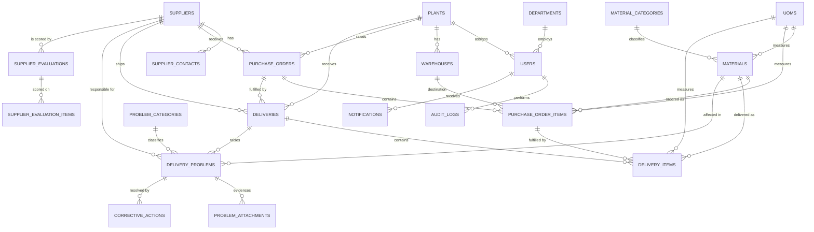

# ERD & Database Schema

## 1. Entity Relationship Diagram



## 2. Table catalogue

`*` = indexed, `!` = unique, `FK` = foreign key.

### departments
| Column | Type | Notes |
|---|---|---|
| id | bigint PK | |
| code | varchar(20) | ! |
| name | varchar(100) | |
| description | text nullable | |
| status | enum(ACTIVE,INACTIVE) | default ACTIVE, * |
| timestamps, deleted_at | | soft delete |

### plants
| Column | Type | Notes |
|---|---|---|
| id | bigint PK | |
| ulid | char(26) | ! route key |
| code | varchar(10) | ! |
| name | varchar(100) | * |
| address | text nullable | |
| city | varchar(100) nullable | |
| pic_name, pic_phone | varchar(100)/varchar(30) nullable | |
| status | enum(ACTIVE,INACTIVE) | * |
| timestamps, deleted_at | | soft delete |

### warehouses
`plant_id` FK → plants (restrict). Unique composite `(plant_id, code)`. Soft delete.

### suppliers
| Column | Type | Notes |
|---|---|---|
| id | bigint PK | |
| ulid | char(26) | ! |
| code | varchar(20) | ! |
| name | varchar(150) | * |
| short_name | varchar(100) nullable | |
| address | text nullable | |
| city, country | varchar(100) nullable | country default 'Indonesia' |
| pic_name, pic_email, pic_phone | varchar nullable | |
| lead_time_days | unsigned int | default 0 |
| payment_term | varchar(50) nullable | |
| supplier_type | enum(LOCAL,IMPORT,TOLLING,SERVICE) | * default LOCAL |
| status | enum(ACTIVE,INACTIVE,BLACKLISTED) | * default ACTIVE |
| timestamps, deleted_at | | soft delete |

### supplier_contacts
`supplier_id` FK → suppliers (cascade). `is_primary` boolean. Index `(supplier_id, is_primary)`.

### material_categories
`code` unique, `status` enum. Soft delete.

### uoms
`code` unique, `type` enum(QTY,WEIGHT,VOLUME,LENGTH,AREA,TIME). Soft delete.

### materials
| Column | Type | Notes |
|---|---|---|
| id | bigint PK | |
| ulid | char(26) | ! |
| code | varchar(30) | ! |
| name | varchar(150) | * |
| category_id | FK → material_categories | restrict, * |
| uom_id | FK → uoms | restrict, * |
| specification | text nullable | |
| minimum_stock, critical_stock | decimal(18,4) default 0 | |
| lead_time_days | unsigned int default 0 | |
| is_critical | boolean default false | * |
| status | enum(ACTIVE,INACTIVE) | * |
| timestamps, deleted_at | | soft delete |

### purchase_orders
| Column | Type | Notes |
|---|---|---|
| id | bigint PK | |
| ulid | char(26) | ! |
| po_number | varchar(30) | ! |
| po_date | date | * |
| supplier_id | FK → suppliers restrict | * |
| plant_id | FK → plants restrict | * |
| currency | varchar(10) default 'IDR' | |
| payment_term | varchar(50) nullable | |
| status | enum(DRAFT,SUBMITTED,APPROVED,PARTIAL,COMPLETED,CANCELLED) | * default DRAFT |
| total_amount | decimal(18,4) default 0 | denormalized sum of items |
| remarks | text nullable | |
| created_by | FK → users nullSet | |
| approved_by | FK → users nullSet, nullable | |
| approved_at | datetime nullable | |
| timestamps | | **no soft delete** — use CANCELLED |

Composite indexes: `(plant_id, po_date)`, `(supplier_id, po_date)`, `(status, po_date)`.

### purchase_order_items
| Column | Type | Notes |
|---|---|---|
| id | bigint PK | |
| purchase_order_id | FK → purchase_orders cascade | * |
| material_id | FK → materials restrict | * |
| warehouse_id | FK → warehouses restrict | * |
| uom_id | FK → uoms restrict | |
| line_no | unsigned smallint | unique with purchase_order_id |
| schedule_delivery_date | date | * |
| qty_ordered | decimal(18,4) | |
| unit_price | decimal(18,4) | |
| amount | decimal(18,4) | generated in service = qty × price |
| **qty_received** | decimal(18,4) default 0 | denormalized rollup |
| **first_receipt_date** | date nullable | |
| **last_receipt_date** | date nullable | |
| **fulfillment_status** | enum(PENDING,SHORT,FULL,OVER) | * default PENDING |
| **timeliness_status** | enum(PENDING,ON_TIME,LATE) | * default PENDING |
| **overall_status** | enum(PENDING,ON_TIME_FULL,LATE_FULL,ON_TIME_SHORT,LATE_SHORT,OVER_DELIVERY) | * |
| remarks | text nullable | |
| timestamps | | |

Composite index `(schedule_delivery_date, overall_status)` for PO monitoring.

### deliveries
| Column | Type | Notes |
|---|---|---|
| id | bigint PK | |
| ulid | char(26) | ! |
| delivery_number | varchar(30) | ! |
| purchase_order_id | FK → purchase_orders restrict | * |
| supplier_id | FK → suppliers restrict | * |
| plant_id | FK → plants restrict | * |
| delivery_date | date | * |
| do_number | varchar(50) nullable | |
| vehicle_number | varchar(30) nullable | |
| driver_name | varchar(100) nullable | |
| received_by | FK → users nullSet, nullable | |
| status | enum(PENDING,RECEIVED,PARTIAL,COMPLETED,CANCELLED) | * default PENDING |
| remarks | text nullable | |
| timestamps | | **no soft delete** |

Composite indexes: `(plant_id, delivery_date)`, `(supplier_id, delivery_date)`, `(status, delivery_date)`.

### delivery_items
| Column | Type | Notes |
|---|---|---|
| id | bigint PK | |
| delivery_id | FK → deliveries cascade | * |
| purchase_order_item_id | FK → purchase_order_items restrict | * |
| material_id | FK → materials restrict | * |
| uom_id | FK → uoms restrict | |
| qty_received | decimal(18,4) | |
| condition | enum(GOOD,DAMAGED,REJECTED,PARTIAL) | default GOOD |
| **timeliness_status** | enum(PENDING,ON_TIME,LATE) | * derived |
| **quantity_status** | enum(PENDING,SHORT,FULL,OVER) | * derived |
| **overall_status** | enum(...6 values) | * derived |
| **days_late** | int default 0 | derived |
| remarks | text nullable | |
| timestamps | | |

### problem_categories
`code` unique (LATE_DELIVERY, SHORT_DELIVERY, WRONG_MATERIAL, DOCUMENT_PROBLEM, QUALITY_PROBLEM, PACKAGING_PROBLEM, SCHEDULE_PROBLEM, OTHER). Soft delete.

### delivery_problems
| Column | Type | Notes |
|---|---|---|
| id, ulid | | ! ulid |
| problem_number | varchar(30) | ! |
| delivery_id | FK → deliveries cascade | * |
| supplier_id | FK → suppliers restrict | * |
| material_id | FK → materials nullSet, nullable | * |
| problem_category_id | FK → problem_categories restrict | * |
| problem_date | date | * |
| description, root_cause | text | root_cause nullable |
| severity | enum(LOW,MEDIUM,HIGH,CRITICAL) | * |
| status | enum(OPEN,IN_PROGRESS,CLOSED,CANCELLED) | * |
| pic | varchar(100) nullable | |
| due_date | date nullable | * |
| closed_at | datetime nullable | |
| created_by | FK → users nullSet | |
| timestamps | | |

Composite indexes `(supplier_id, problem_date)`, `(status, due_date)`, `(problem_category_id, problem_date)`.

### problem_attachments
`delivery_problem_id` FK cascade, `file_name`, `file_path` (private disk), `mime_type`,
`file_size` unsigned bigint, `uploaded_by` FK → users nullSet.

### corrective_actions
`delivery_problem_id` FK cascade, `action_date`, `action_by` FK → users nullSet,
`description` text, `status` enum(OPEN,IN_PROGRESS,DONE), `due_date`, `completed_at`.

### kpi_settings
`code` unique, `name`, `description`, `target_value`, `warning_value`, `critical_value`
decimal(10,4), `unit` varchar(20), `is_active` boolean.

### supplier_evaluations
`supplier_id` FK cascade, `period_year` smallint, `period_month` tinyint,
`delivery_score`/`quality_score`/`quantity_score`/`responsiveness_score`/`total_score` decimal(10,4),
`grade` enum(EXCELLENT,GOOD,AVERAGE,POOR), `remarks`, `created_by`.
**Unique `(supplier_id, period_year, period_month)`.**

### supplier_evaluation_items
`supplier_evaluation_id` FK cascade, `criteria_name`, `weight` decimal(5,2), `score` decimal(10,4), `remarks`.

### notifications
Laravel native: `uuid` PK, `type`, `notifiable` morph, `data` json, `read_at`. See assumption A6.

### audit_logs
`user_id` FK nullSet, `action` varchar(50), `module` varchar(100), `record_id` bigint nullable,
`old_values` json nullable, `new_values` json nullable, `ip_address` varchar(45), `user_agent` text.
Composite index `(module, record_id)`, index `(user_id, created_at)`.

### system_settings
`setting_key` unique varchar(100), `setting_value` text nullable, `type` enum(STRING,INTEGER,DECIMAL,BOOLEAN,JSON),
`group` varchar(50), `description` text nullable.

## 3. Index summary (§34 compliance)

All indexes required by the specification are created, plus composite indexes on the
`(scope, date)` pairs that every dashboard aggregate filters by:

```
suppliers.code!               materials.code!              plants.code!
purchase_orders.po_number!    purchase_orders.supplier_id  purchase_orders.plant_id
purchase_orders.po_date       (plant_id,po_date) (supplier_id,po_date) (status,po_date)
purchase_order_items.purchase_order_id  .material_id  .schedule_delivery_date
purchase_order_items.(schedule_delivery_date, overall_status)
deliveries.delivery_number!   .purchase_order_id  .supplier_id  .plant_id  .delivery_date
deliveries.(plant_id,delivery_date) (supplier_id,delivery_date) (status,delivery_date)
delivery_items.delivery_id  .purchase_order_item_id  .material_id
delivery_items.timeliness_status  .quantity_status  .overall_status
delivery_problems.delivery_id .supplier_id .problem_category_id .problem_date .status
```
